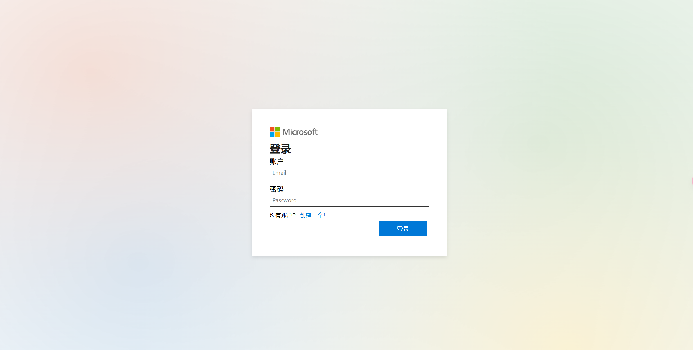
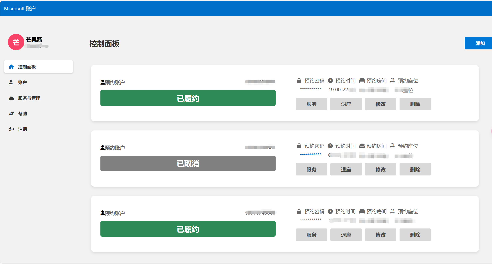
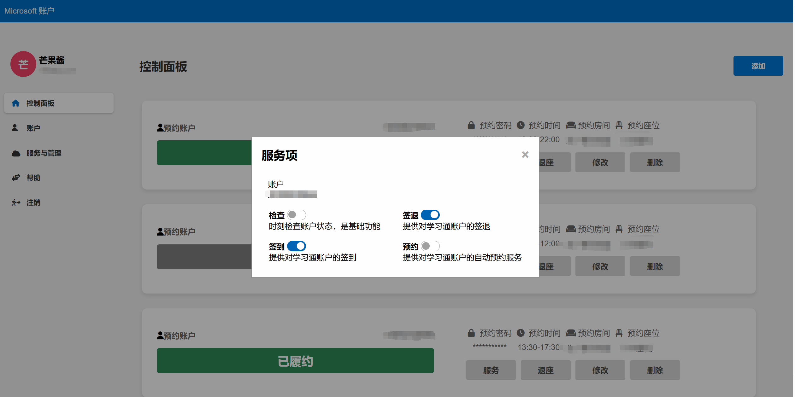

# 图书馆座位预约宝典 —— 开启知识殿堂的便捷之门

## 卷首语

在这个信息爆炸的时代，图书馆成为了知识的海洋，座位的争夺则成为了求知的战场。为了给广大求知者提供一个公平、便捷的座位预约平台，我们倾心打造了这款图书馆座位预约系统。以简洁的HTML为骨骼，以灵活的Python
Flask为血脉，我们为您开启了一扇通往知识殿堂的便捷之门。

## 项目概述

学习通图书馆座位预约系统，是一款基于Web技术的在线服务平台，旨在解决图书馆座位资源分配不均的问题，让每一位读者都能轻松预约到合适的座位。本项目采用HTML构建界面，Python
Flask作为后端支撑，简洁而不失优雅，高效而又稳定。

## 预览项目


**1.登录页面**

---


**2.主页页面**

---


**3.手机页面**

---


**3.服务页面**

---



## 功能亮点

- **用户注册与登录**：一键注册，快速登录，您的个人资料安全有保障。
- **高安全性**：对接口统一加密验证,ip访问限制,服务器安全有保障。
- **在线预约功能**：简单几步操作，即可完成座位预约，让学习不再等待。
- **预约取消服务**：计划有变？无需担心，一键取消，座位资源即时释放。
- **管理员后台**：高效管理资源，实时监控预约情况，提升服务品质。

## 技术架构

- **前端**：HTML、CSS、JavaScript
- **后端**：Python、Flask
- **数据库**： MySQL
- **版本控制**：Git

## 开源协议

本项目采用 GNU General Public License v3 (GPLv3) 许可证，以确保代码的开源性和自由性。
GPLv3 是一种“传染性”开源协议，要求任何基于本项目的代码进行修改、分发或使用时，
必须遵循相同的开源条款，确保代码始终保持开源。

## 快速入门

### 环境准备

1. 安装Python环境。
2. 安装Flask框架。
3. 配置mysql数据库环境。
4. 安装git。

### 项目部署

1. 克隆项目到本地：
   ```bash
   https://github.com/MGJ520/XXT_Seat_Web.git
   ```
2. 进入项目目录，安装依赖：
   ```bash
   pip install -r requirements.txt
   ```
3. 打开config.py配置
   ```
   1.mysql配置数据库连接
   2.Room_data
   3.抢座时间
   ```
4. 运行项目：
   ```bash
   python run.py
   ```
5. 默认端口80,访问 `你的服务器ip` 开始使用。


## 数据库表
```bash
platform_email           VARCHAR(255)     COMMENT '用户邮箱地址',
    account_status           INT              COMMENT '账户状态',
    reservation_account      VARCHAR(255)     COMMENT '用户预约账号',
    reservation_password     VARCHAR(255)     COMMENT '预约密码',
    start_time               TIME             COMMENT '预约开始时间',
    end_time                 TIME             COMMENT '预约结束时间',
    reservation_end_time     DATETIME         COMMENT '预约结束日期',
    room_location            VARCHAR(255)     COMMENT '预约房间的位置',
    seat_location            VARCHAR(255)     COMMENT '预约座位的位置',
    
    refresh_status           BOOLEAN          COMMENT '是否启动检查服务',
    reservation_status       BOOLEAN          COMMENT '是否启动预约服务',
    sign_in_status           BOOLEAN          COMMENT '签到服务是否启动',
    sign_back_status         BOOLEAN          COMMENT '签退服务是否启动',
    monitor_sign_in_status   BOOLEAN          COMMENT '监控签到服务是否启动',

    reservation_times        INT              COMMENT '预约服务剩余次数', -- 修正为 INT
    sign_in_times            INT              COMMENT '签到服务剩余次数',
    sign_back_times          INT              COMMENT '签退服务剩余次数',
    monitor_sign_in_times    INT              COMMENT '监控签到服务剩余次数',
    operation_failure_times  INT              COMMENT '操作失败次数',
```
```bash
 platform_email        VARCHAR(255) PRIMARY KEY COMMENT '用户邮箱地址',
                platform_nickname     VARCHAR(255) COMMENT '用户在平台的昵称',
                platform_password     VARCHAR(255) COMMENT '用户在平台的密码',
                
                platform_account_time DATETIME     COMMENT '注册日期',
                last_login_time       DATETIME     COMMENT '用户上次登录的时间',
                latest_login_ip       VARCHAR(255) COMMENT '用户最近一次登录的IP地址',
                
                
                account_count         INT          COMMENT '用户用户预约账号数',
                login_count           INT          COMMENT '用户登录的总次数',
                login_failure_count   INT          COMMENT '用户登录失败的总次数',
                
                permission_level      INT          COMMENT '用户的权限级别'
```

> 因为开发时间不够，有想法开发的同学们，可以提交贡献：

> 获取座位分布位置api :https://office.chaoxing.com/data/apps/seat/seatgrid/roomid?roomId=8661
>
> 条件查询获取座位api:https://reserve.chaoxing.com/data/apps/seat/getseatinfo?deptIdEnc=&startTime=20%3A00&endTime=21%3A00&firstLevelName=%E7%AC%AC%E4%BA%8C%E5%9B%BE%E4%B9%A6%E9%A6%86

## 结语

图书馆座位预约系统，如同知识的灯塔，照亮您的求学之路。我们诚挚邀请您使用本系统，也希望您能为我们提出宝贵的意见和建议。让我们共同努力，为知识的传播和文化的繁荣添砖加瓦。
